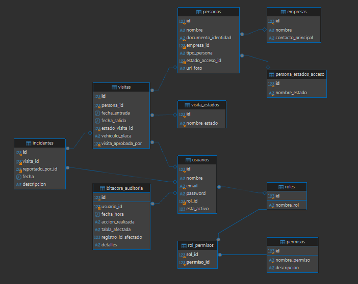

# SICA - Sistema de Control de Acceso

Sistema de control de acceso para complejos cerrados, construido con **arquitectura hexagonal** (puertos y adaptadores) + **Strategy pattern** + **Vertical Slice**.

## Descripción del Proyecto

"Zona Acme" reemplaza su control de acceso manual (libros de registro en papel, radios) por SICA:
un sistema que automatiza y asegura el ingreso/salida de trabajadores e invitados, con roles y
permisos configurables (RBAC), aprobación en tiempo real de visitantes no anunciados, y una
bitácora de auditoría inmutable de cada acción crítica.

## Stack

- **Java 17+** (sin frameworks, solo JDK estándar)
- **MySQL 8+** como motor de BD
- **JDBC** + **Apache Commons DBCP2** para pool de conexiones
- **jBCrypt** para hashing de contraseñas
- **Maven** como build tool

## Arquitectura

```
com.sica/
├── domain/                          ← Entidades puras, cero dependencias
│   ├── port/                        ← Interfaces (puertos de salida)
│   ├── exception/                   ← Excepciones de negocio personalizadas
│   └── (entidades: Usuario, Persona, Visita, etc.)
├── application/                     ← Casos de uso (puertos de entrada)
│   └── strategy/                    ← Strategy pattern: 4 flujos de acceso
└── infrastructure/                  ← Adaptadores concretos
    ├── config/                      ← DatabaseConfig, PasswordUtil
    ├── persistence/                 ← Repositorios JDBC
    └── ui/                          ← Interfaz gráfica Swing
```

Los casos de uso **nunca** importan de `infrastructure`. Solo conocen los puertos de `domain/port`.

## Decisiones de Diseño

### Principios SOLID

- **SRP (Responsabilidad Única):** `AuditoriaService` solo escribe en la bitácora;
  `AutorizacionService` solo verifica permisos; cada `FlujoAccesoStrategy` maneja un único
  flujo de acceso.
- **OCP (Abierto/Cerrado):** para agregar un nuevo flujo de acceso basta con implementar
  `FlujoAccesoStrategy` y registrarlo en `FlujoAccesoFactory`, sin tocar las estrategias
  existentes. Los permisos nuevos se agregan en la tabla `permisos` sin tocar código.
- **LSP (Sustitución de Liskov):** cualquier implementación de `FlujoAccesoStrategy` puede
  usarse donde se espera la interfaz, sin romper el comportamiento del sistema.
- **ISP (Segregación de Interfaces):** los puertos en `domain/port` están separados por
  entidad (`PersonaRepository`, `VisitaRepository`, `IncidenteRepository`, etc.) en vez de un
  único repositorio genérico gigante.
- **DIP (Inversión de Dependencias):** `application` depende únicamente de las interfaces en
  `domain/port`, nunca de `infrastructure`. La inyección de dependencias se hace manualmente
  en `Main.java` / `SicaApp.java`.

### Patrones de Diseño

| Patrón | Dónde | Por qué |
|---|---|---|
| **Strategy** | `application/strategy/FlujoAccesoStrategy` + 4 implementaciones | Cada uno de los flujos de acceso (pre-registrado, no anunciado, carnet olvidado, salida olvidada) tiene su propia lógica intercambiable, sin condicionales gigantes. |
| **Factory** | `FlujoAccesoFactory` | Decide automáticamente qué estrategia aplicar, ocultando la lógica de selección del resto del sistema. |
| **Singleton** | `infrastructure/config/DatabaseConfig` | Garantiza una única instancia del pool de conexiones (DBCP2) durante toda la ejecución. |
| **Repository** | `domain/port/*Repository` | Abstrae el acceso a datos: la capa de aplicación no sabe si los datos vienen de MySQL u otra fuente. |
| **Adapter (Ports & Adapters)** | `infrastructure/persistence/*RepositoryImpl` | Cada implementación adapta el resultado crudo de JDBC al modelo de dominio, cumpliendo el contrato del puerto correspondiente. |

### Excepciones Personalizadas

Todas viven en `domain/exception`, extendiendo la clase base `SicaException`, para representar
explícitamente las reglas de negocio en vez de excepciones genéricas de Java:

- `PersonaNoEncontradaException`
- `VisitaNoEncontradaException`
- `VisitaEnCursoException`
- `EstadoNoEncontradoException`
- `PermisoDenegadoException`
- `TipoPersonaInvalidoException`
- `CredencialesInvalidasException`

## Modelo de la Base de Datos

El diagrama Entidad-Relación completo (generado con DBeaver) está en `docs/diagrama_er.png`.



Resumen de relaciones clave:
- `personas` se relaciona con `empresas` y con `persona_estados_acceso` (Activo / Con
  Prohibición de Ingreso).
- `visitas` referencia a `personas`, a `visita_estados` (Pendiente de Aprobación, Aprobado,
  Rechazado, Dentro, Fuera, Expirado) y a `usuarios` (quién aprobó el ingreso).
- `incidentes` referencia a `visitas` y a `usuarios` (quién reportó).
- `usuarios` tiene un `rol_id`; los roles obtienen sus permisos a través de la tabla puente
  `rol_permisos` (relación muchos a muchos entre `roles` y `permisos`) — esto implementa el RBAC.
- `bitacora_auditoria` referencia a `usuarios` y guarda qué tabla y registro fue afectado por
  cada acción crítica del sistema.

## Configuración de la Base de Datos

1. **Crear la BD en MySQL:**
   ```sql
   CREATE DATABASE sica CHARACTER SET utf8mb4 COLLATE utf8mb4_unicode_ci;
   ```

2. **Ejecutar el esquema y los datos iniciales:**
   ```bash
   mysql -u root -p sica < src/main/resources/sql/schema.sql
   mysql -u root -p sica < src/main/resources/sql/data.sql
   ```
   > Si ya tenías una BD `sica` de una versión anterior del proyecto, vuelve a correr ambos
   > scripts para traer las tablas/columnas y permisos nuevos (ej. `aprobar_visita`).

3. **Configurar credenciales:**
   Edita `src/main/resources/jdbc.properties`:
   ```properties
   db.url=jdbc:mysql://localhost:3306/sica
   db.username=root
   db.password=tu_password
   db.driver=com.mysql.cj.jdbc.Driver
   ```

## Ejecutar

```bash
# Compilar
mvn clean compile

# Ejecutar la interfaz gráfica (recomendado)
mvn compile exec:java -Dexec.mainClass="com.sica.infrastructure.ui.MainSwing"

# Ejecutar la versión de consola (respaldo)
mvn compile exec:java -Dexec.mainClass="com.sica.Main"
```

## Usuarios de Ejemplo por Rol

| Rol | Email | Contraseña | Descripción |
|-----|-------|------------|-------------|
| **Superusuario** | admin@sica.com | admin123 | Acceso total al sistema |
| **Supervisor de Seguridad** | supervisor@sica.com | supervisor123 | Reporta incidentes, supervisa flujos |
| **Guarda de Seguridad** | guarda@sica.com | guarda123 | Registra ingresos/salidas de visitas |
| **Funcionario de Empresa** | funcionario@sica.com | funcionario123 | Registra y aprueba visitas de su empresa |

> ⚠️ Cambia estas contraseñas en producción. Los hashes de ejemplo usan BCrypt.

## Flujos de Acceso (Strategy Pattern)

| # | Flujo | Descripción |
|---|-------|-------------|
| 1 | **Invitado Pre-Registrado** | Persona ya registrada. Si tiene una visita "Aprobado", se registra la entrada (pasa a "Dentro"); si no, se ingresa directamente. |
| 2 | **Invitado No Anunciado** | Persona no tiene visita programada. Se crea la visita con estado **"Pendiente de Aprobación"** en vez de dar acceso inmediato. |
| 3 | **Trabajador con Carnet Olvidado** | Trabajador conocido sin carnet. Se crea un ingreso "Pendiente de Aprobación" para que su funcionario lo autorice puntualmente. |
| 4 | **Salida Olvidada** | Persona dentro que olvidó salir. Se cierra automáticamente la visita anterior y se crea un nuevo registro para el ingreso actual. |

## Aprobación de Solicitudes (Funcionario de Empresa)

Cuando un guarda registra un Invitado No Anunciado o un Trabajador con Carnet Olvidado, la
visita queda "Pendiente de Aprobación". Un usuario con el permiso `aprobar_visita` (rol
Funcionario de Empresa) entra a la sección **"Aprobar Acceso"**, donde puede:

- Consultar todas las solicitudes pendientes (`consultarSolicitudesPendientes`).
- Aprobarlas (`aprobarVisita`) → la visita pasa a estado "Aprobado" y queda lista para que el
  guarda registre la entrada por el flujo de Invitado Pre-Registrado.
- Rechazarlas (`rechazarVisita`) → la visita pasa a estado "Rechazado".

Cada aprobación/rechazo queda registrado en la bitácora de auditoría con el ID del funcionario
que tomó la decisión.

## Licencia

Proyecto interno de uso privado.

## Autor

Manuel Isaac Camaño Diaz
